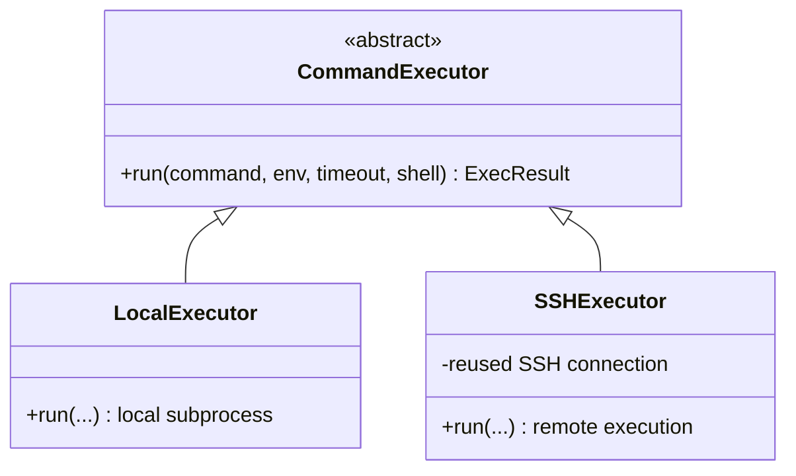

# Execution model

## What this is

The commands the backend runs (kubectl, cloud CLI, etc.) sometimes need to originate from the machine hosting the backend itself, and sometimes from another machine with specific network access (e.g. a cluster reachable only from a given host). Aegis hardcodes no assumption about this: each tenant picks, in its config, an executor — `local` (a subprocess on the backend's machine) or `ssh` (remote execution via a configured SSH connection). This is *not* a "bastion" concept — just a remote machine reachable via SSH, configured like any other.

## The two modes

```yaml
# local (default) — the backend already has direct network access to the infra
tenants:
  demo:
    exec:
      mode: local

# ssh — commands run on a remote host, reached via SSH
tenants:
  acme-corp:
    exec:
      mode: ssh
      ssh:
        host: "10.0.0.5"
        user: "opsagent"
        port: 22
        key_path: "~/.ssh/aegis_acme-corp"
        certificate_path: "~/.ssh/aegis_acme-corp-cert.pub"  # optional, see below
        known_hosts_path: "~/.ssh/aegis_acme-corp_known_hosts"  # optional, see §Security
```

`certificate_path` is for setups using short-lived certificate-based auth instead of a static key — e.g. Azure AD via `az ssh config`, or a Vault SSH secrets engine. The certificate is only checked at connection time, not per command, so a session opened before the certificate expires stays valid; refreshing the file in place (same path, new content, however that's done outside Aegis) is picked up on the next reconnect, no restart needed.

`exec.mode` can be set in `config/global.yaml` (a default for all tenants) and overridden per tenant in `config/tenants.yaml` — see [`multi-tenant.md`](multi-tenant.md).

## SSH exec — connecting to a real box, by environment

`exec.mode: ssh` doesn't care *how* you got network access and a keypair to the target — it just needs `host`/`user`/`key_path` (and optionally `certificate_path`) that already work with plain `ssh`. What varies is how each environment hands those out. Four patterns, from simplest to most involved:

### A VM on your local network / VPN

The baseline case — no cloud provider involved. Generate a normal keypair, install the public half on the box, point Aegis at the private half:

```bash
ssh-keygen -t ed25519 -f ~/.ssh/aegis_lab-vm -N ""
ssh-copy-id -i ~/.ssh/aegis_lab-vm.pub opsagent@192.168.1.50
ssh-keyscan 192.168.1.50 >> ~/.ssh/aegis_lab-vm_known_hosts
```

```yaml
tenants:
  lab-vm:
    exec:
      mode: ssh
      ssh:
        host: "192.168.1.50"
        user: "opsagent"
        key_path: "~/.ssh/aegis_lab-vm"
        known_hosts_path: "~/.ssh/aegis_lab-vm_known_hosts"
```

No `certificate_path` — that field only matters for the ephemeral-credential patterns below. This is the same shape as the `acme-corp` example in [`config/tenants.yaml.example`](../config/tenants.yaml.example).

### Azure — Azure AD certificate-based SSH

Instead of a static key, Azure AD-joined VMs can issue you a short-lived SSH certificate on demand — no key to provision or rotate on the VM side, access is governed by Azure RBAC instead. This is the pattern `certificate_path` was built for, verified end to end against a real Azure AD-joined bastion VM.

```bash
az extension add --name ssh   # once
az ssh config --resource-group <rg> --name <vm-name> --file "$(mktemp)"
```

The printed config text is disposable, but the key material it references lands in a stable, deterministic location keyed by resource group + VM name (`<cache-dir>/az_ssh_config/<rg>-<vm-name>/id_rsa` and `id_rsa.pub-aadcert.pub` — the exact `<cache-dir>` depends on the `az ssh` extension version, `$TMPDIR` on some, `~/.ssh` on others; the command's own output says exactly where). Wire those paths in directly:

```yaml
tenants:
  azure-bastion:
    exec:
      mode: ssh
      ssh:
        host: "<VM public IP or hostname — printed by az ssh config as HostName>"
        user: "<you>@<azure-ad-tenant-domain>"   # printed as User
        key_path: "<cache-dir>/az_ssh_config/<rg>-<vm-name>/id_rsa"
        certificate_path: "<cache-dir>/az_ssh_config/<rg>-<vm-name>/id_rsa.pub-aadcert.pub"
        known_hosts_path: "~/.ssh/aegis_azure-bastion_known_hosts"
```

The certificate is valid ~1h (an Azure AD limit, not configurable). Refresh by re-running the same `az ssh config` command — it overwrites the same files in place, and since the certificate is only checked at connection time (not per command, see above), Aegis just needs to reconnect after the old session drops. No restart needed.

If the VM has no public IP and sits behind the managed Azure Bastion *service* (a different thing from "a VM you SSH to as a bastion" — Azure's own product), open the network path first with `az network bastion tunnel --resource-group <rg> --name <bastion-name> --target-resource-id <vm-id> --resource-port 22 --port <local-port>`, then point `host` at `127.0.0.1` / `port` at `<local-port>` — that tunnel has to stay running externally, same idea as the Cloudflare Tunnel setup in [`deployment.md`](deployment.md).

### AWS

EC2 doesn't have a direct equivalent of Azure AD certificate auth. Two more common patterns instead:

- **Static keypair on a directly reachable bastion** — the standard EC2 approach: a `.pem` key downloaded at instance launch (or one you generated and pushed via `aws ec2-instance-connect send-ssh-public-key`, worth knowing about but its keys expire after 60 seconds — a poor fit for Aegis's reused, long-lived connection, since a brand new connection attempt after that window needs a fresh push). For a bastion you SSH to normally, the launch keypair works exactly like the local-network case above — just `key_path` pointing at the `.pem`, no `certificate_path`.
- **Private instance, no public IP — SSM Session Manager port forward**: `aws ssm start-session --target <instance-id> --document-name AWS-StartSSHSession --parameters portNumber=22 --local-port-number=<port>` opens an IAM-authenticated tunnel to the instance's SSH port without it ever needing a public IP or an open security group rule; point Aegis at `host: 127.0.0.1`, `port: <port>`, with whatever key the instance actually trusts. Same "external tunnel that has to stay running" shape as the Azure Bastion service case above.

### GCP

`gcloud compute config-ssh` is the simplest path: it provisions a *static* keypair (`~/.ssh/google_compute_engine`), uploads the public half to project metadata via OS Login, and writes matching `Host` entries to `~/.ssh/config` — read `host`/`user`/`key_path` straight out of that generated config, no certificate and no renewal to think about:

```bash
gcloud compute config-ssh
grep -A4 "Host <instance-name>" ~/.ssh/config
```

For an instance with no public IP, `gcloud compute start-iap-tunnel <instance-name> 22 --local-host-port=localhost:<port>` opens an IAM-authenticated IAP tunnel (GCP's equivalent of the AWS SSM / Azure Bastion cases above) — point Aegis at `127.0.0.1`/`<port>` with the same key, and keep the tunnel running externally.

## kubectl and `exec.mode: ssh`

`tenant.kubeconfig_dir` (used by the kubectl tools to build an explicit `KUBECONFIG`, see [`backend/app/agent/tools/env.py`](../backend/app/agent/tools/env.py)) names a path on the **backend's own filesystem** — meaningless on a remote host. In `ssh` mode, Aegis sends no `KUBECONFIG` override at all over the SSH session: the remote host is expected to already have its own default kubectl setup (e.g. a system-wide `~/.kube/config`) for whatever cluster it's meant to reach. There's currently no equivalent of `kubeconfig_dir` for a path on the remote side — if that's ever needed, `KUBECONFIG=<remote-path> kubectl ...` works fine as a `run_command` today, just without the per-tenant isolation `kubeconfig_dir` gives local mode.

## Implementation

One interface, two implementations, no other code in the project calls `subprocess` directly:



- [`backend/app/exec/base.py`](../backend/app/exec/base.py) — `CommandExecutor` interface + `ExecResult` (stdout/stderr/returncode/error).
- [`backend/app/exec/local.py`](../backend/app/exec/local.py) — `LocalExecutor`, local asyncio subprocess (argv list or `shell=True` for pipes/redirections).
- [`backend/app/exec/ssh.py`](../backend/app/exec/ssh.py) — `SSHExecutor`, `asyncssh` connection reused across calls (no new handshake per command).
- [`backend/app/exec/factory.py`](../backend/app/exec/factory.py) — `get_executor(tenant)` resolves the right executor from the tenant's config, with a per-tenant cache for SSH connections.

## Transparency

Two ways to check where commands actually run, without reading `config/tenants.yaml` by hand:

- `GET /api/tenants/config` — the active tenant's resolved config (`exec.mode`, `exec.target` — `"local"` or `"ssh://user@host:port"` —, `ollama.url`, `kubeconfig_dir`, `tools_enabled`). Displayed in the UI's **⚙️ Configuration** panel.
- Every tool call result that represents an executed command carries an `executed_via` field (same value as `exec.target`) — visible in `ToolCallCard` (a "· executed via ..." badge) without having to expand the full JSON.

`describe_executor(tenant)` (`app/exec/factory.py`) is the single source of this description, used in both places.

## Security

`exec.ssh.known_hosts_path` (optional) points to an OpenSSH-format `known_hosts` file to pin the remote host's key — generate it with `ssh-keyscan <host> >> ~/.ssh/aegis_<tenant>_known_hosts` before the first deployment. If absent, verification is disabled (default behavior, an explicit warning is logged on every connection): acceptable on a trusted network the operator controls, but it's a real MITM risk on an untrusted network — fill this in before any deployment that crosses one.
