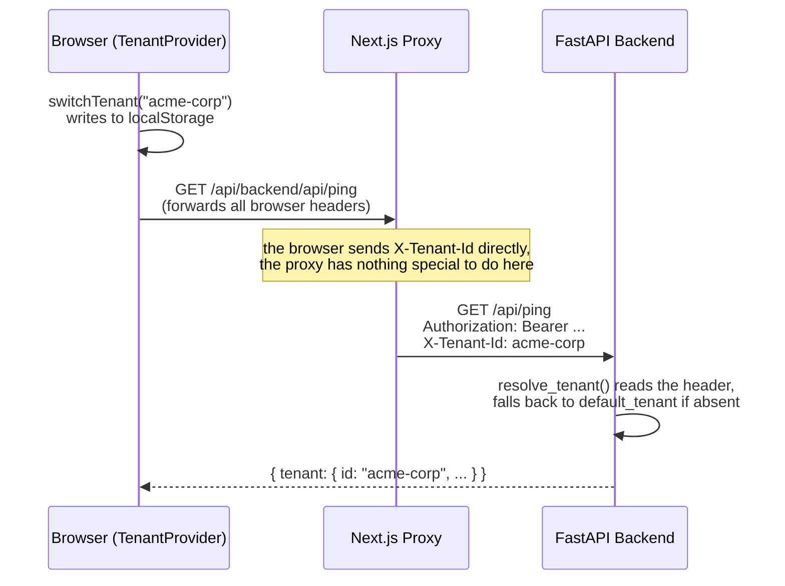

# Multi-tenant

## What this is

A "tenant" in Aegis represents a full context — typically a client or an environment — with its own config (Kubernetes/cloud access, LLM provider — Ollama, LM Studio, or AirLLM, see [`llm-providers.md`](llm-providers.md) — execution machine, enabled tools, isolated RAG index — see [`rag.md`](rag.md)). Multiple tenants coexist in the same Aegis instance; the operator switches between them instantly, without restarting anything.

## Configuration

Two files, in `config/`:

- **`global.yaml`** (optional) — installation-wide defaults: Ollama URL, default execution mode. Absent = defaults built into the code.
- **`tenants.yaml`** (required) — the list of tenants themselves, plus `default_tenant`.

Each tenant can override any defaults field, field by field (deep merge):

```yaml
# config/global.yaml
ollama:
  url: "http://localhost:11434"
exec:
  mode: local
```

```yaml
# config/tenants.yaml
default_tenant: demo

tenants:
  demo:
    name: "Demo"
    tools_enabled: [kubectl, argocd, run_command]
    # exec.mode absent → inherits global.yaml (local)

  acme-corp:
    name: "Acme Corp"
    ollama:
      url: "http://ollama.acme.internal:11434"  # override: a dedicated LLM for this tenant
    exec:
      mode: ssh                                    # override: commands run remotely
      ssh:
        host: "10.0.0.5"
        user: "opsagent"
        key_path: "~/.ssh/aegis_acme-corp"
    tools_enabled: [kubectl, run_command]
```

See [`config/tenants.yaml.example`](../config/tenants.yaml.example) and [`config/global.yaml.example`](../config/global.yaml.example) for commented examples, and [`execution-model.md`](execution-model.md) for the detail of `exec.mode`.

## Hot reload

Both files are watched independently by comparing `mtime` on every request (no watcher, near-zero cost). Editing `tenants.yaml` or `global.yaml` takes effect **immediately**, without restarting the backend — handy for adding a client mid-session. An invalid config (malformed YAML, unknown `default_tenant`, `exec.mode: ssh` without an `ssh` block…) fails explicitly (clear error message returned by `/api/tenants`), never silently.

Implementation: [`backend/app/config/tenants.py`](../backend/app/config/tenants.py) (`TenantRegistry`), pydantic schema in [`backend/app/config/schema.py`](../backend/app/config/schema.py).

## Active tenant: no global server-side state

The backend keeps **no mutable global variable** for "the active tenant" — that would break the moment two tabs/sessions point at different tenants at the same time. Instead, every request carries the target tenant in an `X-Tenant-Id` header:



On the frontend side, this choice has a direct consequence on the React architecture: the active tenant must live in a **shared Context** (`TenantProvider`, see [`frontend/hooks/useTenant.tsx`](../frontend/hooks/useTenant.tsx)) rather than a local hook called independently by each component — two independent instances of "the same" logic would diverge the moment one switches without the other knowing. `frontend/lib/api.ts` reads the active tenant from `localStorage` and injects it as a header on every `apiFetch()` call.

On the backend side: `resolve_tenant()` (a FastAPI dependency, in `app/config/tenants.py`) reads `X-Tenant-Id`, falls back to `default_tenant` if the header is absent, returns 404 if the requested tenant doesn't exist.
