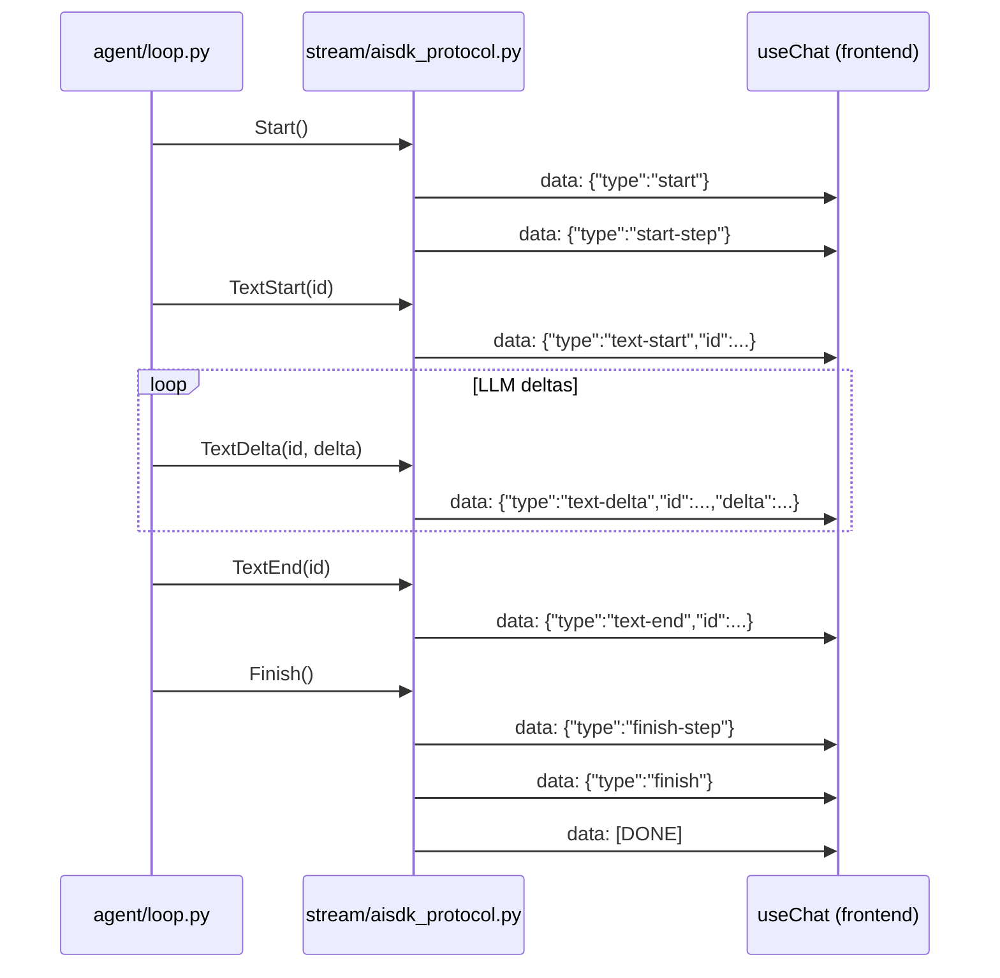

# Streaming protocol

## What this is

The frontend consumes the chat via `useChat` (`@ai-sdk/react`), which expects an SSE stream following the *AI SDK UI Message Stream Protocol*. There's no official Python SDK for this protocol — the Aegis backend implements it itself. This doc explains the exact format and how it was verified, useful if you want to contribute to streaming or the confirmation flow (see [`security-model.md`](security-model.md#confirmation-flow)).

## How the format was verified

Not by reading the online docs, which can drift from the actual shipped behavior: by installing `ai`/`@ai-sdk/react` in `frontend/` and reading `node_modules/ai/dist/index.js` directly — the real implementation, not a description of it. Versions verified: `ai@7.0.79`, `@ai-sdk/react@4.0.82`.

Two things worth knowing if you're touching this code:

1. **The client is strict about `text-start`/`text-end`**: a `text-delta` without a prior `text-start` for the same `id` throws (`"Ensure a text-start chunk is sent before any text-delta chunks"`, verified in the source). The encoder therefore can't be a stateless 1:1 mapping for text — see `TextStart`/`TextEnd` in `app/agent/events.py` and their emission in `app/agent/loop.py`.
2. **There's a native tool approval mechanism** (`tool-approval-request` / `tool-approval-response`, types `ToolApprovalRequestOutput`/`ToolApprovalResponseOutput`) — Aegis's confirmation flow rides on top of this instead of inventing its own protocol; see [ADR 0002](adr/0002-native-tool-approval-instead-of-custom-confirmation.md) for why.

## Confirmed format

**Headers** (`AISDK_STREAM_HEADERS` in `app/stream/aisdk_protocol.py`):

```
content-type: text/event-stream
cache-control: no-cache
connection: keep-alive
x-vercel-ai-ui-message-stream: v1
x-accel-buffering: no
```

**Framing**: each event is a `data: {json}\n\n` line; the stream always ends with `data: [DONE]\n\n`.

**Typical turn sequence** (text only):



**With a tool call**: `tool-input-available` (with `"dynamic": true` — our tools are defined server-side only, never declared to the client, so rendered as `DynamicToolUIPart`) then `tool-output-available` or `tool-output-error`, before resuming text if the LLM replies after the result.

**Incoming request** (`POST /api/chat`, handled by `app/routers/chat.py`) — JSON body sent by `useChat`:

```json
{
  "id": "chat-id",
  "messages": [
    {"id": "m1", "role": "user", "parts": [{"type": "text", "text": "..."}]}
  ],
  "trigger": "submit-message",
  "messageId": "...",
  "safetyMode": "readonly"
}
```

`safetyMode` (and later `model`) are custom fields added via the transport's `body` option on the frontend (`ChatPanel.tsx`) — the AI SDK merges them at the root of the body, so no special mechanism is needed to carry them through.

## Separation of concerns

- `app/agent/events.py` — internal events (`AgentEvent`), zero knowledge of the protocol.
- `app/agent/loop.py` — tool-calling loop, yields `AgentEvent`, zero knowledge of the protocol.
- `app/stream/aisdk_protocol.py` — the **only** file that translates `AgentEvent` → SSE JSON. If the AI SDK protocol changes, this is the only place to touch.
- Tests: `backend/tests/test_aisdk_protocol.py` (exact format, isolated) and `backend/tests/test_chat_router.py` (end to end with a fake Ollama provider, no dependency on a real Ollama).

## Known limitation

The history sent to the LLM between two HTTP turns doesn't reconstruct already-resolved `dynamic-tool` parts (`state: "output-available"`) from previous turns — only the assistant's text about them is kept (see `_extract_text`, `app/routers/chat.py`). There's a narrower special case for the confirmation flow specifically: `_find_pending_approval` inspects the history for a part in `"approval-responded"` state (a confirmation that was just resolved) and executes it — but a tool result already shown earlier in the conversation isn't re-fed to the LLM as structured context on later turns. In practice, the LLM keeps the text it wrote about it itself, which covers most exchanges but can lose detail over a long history. Full reconstruction isn't implemented — worth doing if this turns out to matter in practice.
