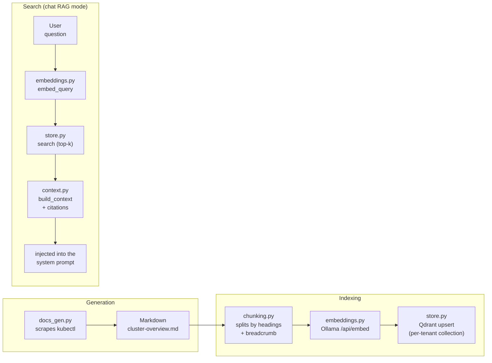

# Living documentation & RAG

## What this is

Rather than depending on pre-existing external documentation (often missing or stale), Aegis generates its own documentation by scraping the active tenant's real infrastructure, indexes it in a vector database, and uses it to enrich its answers with source citations — a full RAG (Retrieval-Augmented Generation) pipeline, with embeddings computed locally (no dependency on a cloud API).

## Full pipeline



1. **Generation** (`app/rag/docs_gen.py`): scrapes kubectl (namespaces, pods, deployments, services) on the active tenant's cluster, produces a Markdown document. V1 is limited to kubectl — no Terraform or LLM narrative generation (deferred to V1.1, see the plan).
2. **Chunking** (`app/rag/chunking.py`): splits by heading structure rather than a blind sliding window — each chunk is prefixed with its "breadcrumb" (e.g. `Cluster > Pods`) so the hierarchical context isn't lost once isolated.
3. **Embeddings** (`app/rag/embeddings.py`): 100% local via Ollama (`POST /api/embed`), `nomic-embed-text` model by default (768 dimensions).
4. **Storage** (`app/rag/store.py`): one Qdrant collection per tenant (`aegis_{tenant_id}`) — hard isolation, no shared `tenant_id` filter that could leak on a bug. Deterministic point IDs (UUID5 derived from tenant+source+chunk index): re-indexing a source cleanly overwrites its old chunks without duplicating them. `QDRANT_URL` isn't limited to the local container the docker-compose quickstart bundles — point it at any reachable Qdrant, including a managed/remote instance (e.g. Qdrant Cloud), and set `QDRANT_API_KEY` if that instance requires one.
5. **Search** (`app/rag/context.py`): in the chat's RAG mode, the user's last question is embedded and compared against the indexed chunks (dense search, cosine). Results are formatted with numbered citations and injected into the system prompt.

## Usage

In the UI, the RAG panel (sidebar): the **Generate** button triggers scraping + indexing for the active tenant, the status shows the number of indexed chunks. The **Ops / RAG** toggle in the chat switches between normal mode (tools only) and RAG mode (documentation context injected on top of the tools — both can combine, the LLM keeps access to its tools even in RAG mode).

A second panel, **Indexed content (RAG)**, lets you browse directly what's been indexed — documents grouped, expandable chunks with their breadcrumb and full text (`RagDocumentsPanel.tsx`): no need to guess what RAG mode "sees", you can read it yourself.

On the API side:
- `POST /api/rag/generate` — scrapes + indexes for the active tenant (resolved via `X-Tenant-Id`)
- `GET /api/rag/status` — `{ready, points_count}` for the active tenant
- `GET /api/rag/documents` — indexed content grouped by document (`{documents: [{source_path, chunk_count, chunks: [...]}]}`), for browsing/debugging
- `POST /api/chat` with `{"mode": "rag", ...}` — enriches the system prompt with the retrieved context, emits a `data-ragSources` part (citations) before the response text

## Cited sources — real example

Question: *"How many namespaces are there according to the indexed docs?"*

```json
{
  "sources": [
    {"index": 1, "source_path": "cluster-overview.md", "heading_path": "... > Namespaces", "score": 0.62},
    {"index": 2, "source_path": "cluster-overview.md", "heading_path": "... > Pods", "score": 0.48}
  ]
}
```

The "Namespaces" chunk comes out with the best score for a question about namespaces — semantic search works as expected (verified under real conditions, not just in tests).

## Deferred (V1.1)

- **Local hybrid search + reranking** (dense+sparse via Qdrant + `fastembed`, no API/torch dependency) — V1 stays with simple dense search.
- **Terraform scraper** + LLM narrative doc generation.
- **Local sources** (indexing existing Markdown files alongside the auto-generated docs).
