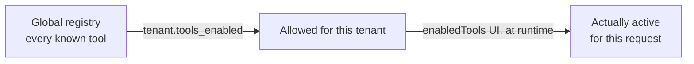

# Tools — registry, per-tenant activation, runtime restriction

## What this is

A "tool" is a function the LLM can call during the conversation — `kubectl_get`, `run_command`, etc. Every tool is described with the same internal schema regardless of which LLM provider the tenant uses; Ollama and LM Studio both take native function-calling, while AirLLM gets the same schema turned into prompt instructions instead (see [`llm-providers.md`](llm-providers.md#airllm)). Aegis has three activation levels, from most fixed to most dynamic:

1. **The global registry** (`app/agent/tools/registry.py`): every tool the code knows how to run. This is an absolute ceiling — a tool that isn't in it can never be called, whatever the config says.
2. **`tenant.tools_enabled`** (`config/tenants.yaml`): the upper bound for this specific tenant — groups (`kubectl`, `argocd`) or precise names (`kubectl_get`). Set by the operator, not editable from the UI.
3. **Runtime restriction** (`enabledTools` sent by the frontend on every `/api/chat` request): lets you temporarily disable some tools for a given conversation, from the UI's **⚙️ Settings** panel. It can **never widen** what (2) allows — only narrow it.



## The security boundary

`get_enabled_tools(tenant, override_names)` (`app/agent/tools/registry.py`) computes an intersection, never a union:

```python
allowed = tenant_allowed_tool_names(tenant)   # (1) ∩ (2)
if override_names is not None:
    allowed &= override_names                  # ∩ (3) — can only narrow
```

It's not just a matter of which schemas get sent to the LLM: the agent loop (`app/agent/loop.py`) explicitly rechecks `tc.name not in allowed_tool_names` before executing a tool call, even if the LLM tries to call one that wasn't in the schemas provided. A local LLM can hallucinate a call to a tool it was never shown — the check shouldn't rely solely on "we didn't show it the schema." See `backend/tests/test_registry.py` (the `override_names` case that tries to widen the set) and `backend/tests/test_chat_router.py::test_chat_rejects_tool_call_disabled_via_runtime_toggle` (end to end, the LLM calls a disabled tool anyway → refused without execution).

## Inspecting tool configuration

`GET /api/tools` — for the active tenant (`X-Tenant-Id`), returns for every known tool:

```json
{
  "tools": [
    {
      "name": "run_command",
      "enabled": true,
      "guarded": true,
      "schema": {
        "type": "function",
        "function": {
          "name": "run_command",
          "description": "Arbitrary shell command...",
          "parameters": { "type": "object", "properties": { "command": {"type": "string"} }, "required": ["command"] }
        }
      }
    }
  ]
}
```

- `enabled`: allowed by `tenant.tools_enabled` (bound (2) above — not yet narrowed by any runtime `enabledTools`, which is scoped to a conversation, not the config).
- `guarded`: subject to guardrails (`classify` is not `None`, see [`security-model.md`](security-model.md)) — `kubectl_get` isn't (always-safe), `run_command` is (dynamic command classification).
- `schema`: this tool's canonical schema (`tool_to_ollama_schema()`, the same function used by `app/agent/loop.py`) — named after the Ollama-shaped function-calling format it was originally written for. That format is already OpenAI-compatible, so LM Studio gets it unchanged; only AirLLM's `_tools_instructions` (`app/stream/airllm_provider.py`) turns it into prompt text instead, since AirLLM has no native function-calling. Useful for understanding why a model does (or doesn't) pick a given tool, regardless of which provider the tenant actually runs.

Displayed in the UI's **⚙️ Settings** panel: a list of tools with a toggle per tool (feeds `enabledTools`) and each tool's description underneath (`ToolsPanel.tsx` reads `schema.function.description` — the raw JSON schema itself isn't rendered in the UI, use `GET /api/tools` directly if you need it).

## Model selection

`GET /api/llm/models` is provider-aware — for `ollama`/`lmstudio` tenants it queries the provider's live models endpoint (`/api/tags`, `/v1/models`); for `airllm` it returns the single model fixed in that tenant's config, since there's nothing to discover at runtime. See [`llm-providers.md`](llm-providers.md) for the full picture (multiple LLM backends, not just Ollama). The frontend uses it to populate the model dropdown in the Settings panel; the chosen model is sent in the body of `/api/chat` (`model`, see `app/routers/chat.py`). If the target is unreachable, the endpoint responds `200` with `models: []` and an `error` field — no 500, so the UI can show a clear state instead of crashing.
